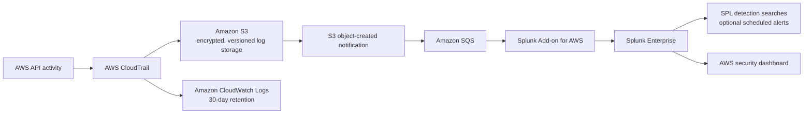
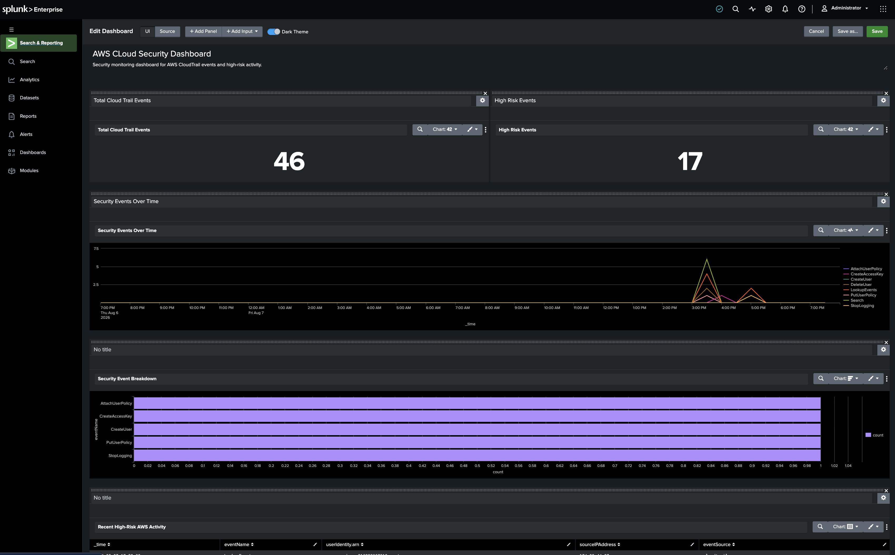

# AWS Cloud Detection Pipeline

An end-to-end AWS security telemetry and detection project built with Terraform, CloudTrail, S3, SQS, CloudWatch, Docker, and Splunk Enterprise. It demonstrates how AWS API activity can be collected, transported to a local SIEM, searched with SPL, and surfaced through validated detections and a security dashboard.

## Project Overview

AWS control-plane activity is valuable security telemetry, but it must be collected reliably and made available to analysts. This project provisions a multi-Region CloudTrail, protects and retains its S3 log objects, sends object-created notifications through SQS, and grants a dedicated Splunk IAM identity the limited S3 and SQS permissions required for ingestion.

Splunk Enterprise runs locally in Docker. With the Splunk Add-on for AWS configured, CloudTrail events are indexed as `aws:cloudtrail` and evaluated using the documented SPL searches in [`detections/`](detections/).

## Architecture



CloudWatch provides a second, near-real-time destination for CloudTrail events. The implemented Splunk ingestion path uses S3 and SQS.

## Detection Pipeline

1. An AWS API operation occurs.
2. The multi-Region CloudTrail records the operation, including global service events.
3. CloudTrail delivers validated log files to the encrypted, versioned S3 bucket and also sends events to CloudWatch Logs.
4. Each new S3 object produces an SQS notification.
5. The Splunk Add-on for AWS polls the queue using the dedicated IAM identity.
6. Splunk retrieves the referenced CloudTrail object from S3 and processes it with the `aws:cloudtrail` sourcetype.
7. SPL searches identify security-relevant events.
8. The dashboard provides analyst visibility, and the searches can be configured as scheduled alerts.

SQS decouples S3 delivery from SIEM ingestion: it tells Splunk which new objects are available without requiring Splunk to continuously list the bucket.

## Infrastructure as Code

Terraform provisions the AWS side of the pipeline:

| Component | Purpose |
| --- | --- |
| CloudTrail | Records multi-Region AWS API activity, global service events, and log-file integrity data |
| Amazon S3 | Stores CloudTrail logs with AES-256 server-side encryption, versioning, and public-access blocking |
| Amazon SQS | Receives S3 object-created notifications for Splunk ingestion |
| AWS IAM | Allows CloudTrail to write logs and gives the Splunk identity scoped S3/SQS read-and-consume permissions |
| CloudWatch Logs | Receives CloudTrail events with 30-day retention |
| Splunk Enterprise | Ingests, searches, detects, alerts on, and visualizes CloudTrail telemetry |

The S3 bucket policy is limited to the CloudTrail service's ACL check and log delivery. A separate CloudTrail role can only create log streams and publish events to the configured CloudWatch log group. The Splunk IAM policy permits bucket discovery and object reads plus the queue operations required to receive and delete processed messages. `sqs:ListQueues` uses a wildcard resource because that API does not support resource-level permissions.

## Detection Rules

| Detection | CloudTrail event or condition | Severity | Purpose | Validation |
| --- | --- | --- | --- | --- |
| [IAM Access Key Creation](detections/iam-access-key-creation.md) | `CreateAccessKey` | Medium | Identifies creation of new long-term programmatic credentials | Controlled simulation |
| [IAM Administrator Policy Attachment](detections/iam-admin-policy-attachment.md) | `AttachUserPolicy` with `AdministratorAccess` | High | Detects a high-impact IAM privilege change | Controlled simulation; policy immediately removed |
| [CloudTrail Logging Disabled](detections/cloudtrail-stop-logging.md) | `StopLogging` | Critical | Identifies attempts to reduce AWS audit visibility | Controlled simulation; logging restored |
| [AWS Root Account Activity](detections/root-account-activity.md) | `userIdentity.type="Root"` | Critical | Identifies API activity performed by the account root identity | Existing historical telemetry; no new root activity generated |

## Detection Examples

### AdministratorAccess policy attachment

This search narrows `AttachUserPolicy` events to attachment of the AWS-managed administrator policy:

```spl
index=* sourcetype="aws:cloudtrail"
eventName="AttachUserPolicy"
requestParameters.policyArn="*AdministratorAccess"
| table _time eventName userIdentity.arn sourceIPAddress requestParameters.userName requestParameters.policyArn
| sort - _time
```

### CloudTrail logging disabled

Any successful `StopLogging` call is treated as critical because it can interfere with audit visibility:

```spl
index=* sourcetype="aws:cloudtrail"
eventName="StopLogging"
| table _time eventName userIdentity.arn sourceIPAddress userAgent requestParameters.name
| sort - _time
```

### Root account activity

This rule monitors all CloudTrail API activity associated with the root identity:

```spl
index=* sourcetype="aws:cloudtrail"
userIdentity.type="Root"
| table _time eventName eventSource sourceIPAddress userAgent userIdentity.type
| sort - _time
```

## Attack Simulation and Validation

Controlled AWS API actions generated telemetry for the access-key, administrator-policy, and logging-disabled detections:

```text
Simulated AWS API activity
        ↓
CloudTrail event
        ↓
S3 log object
        ↓
SQS notification
        ↓
Splunk ingestion
        ↓
SPL detection
```

The temporary `AdministratorAccess` attachment was removed immediately after telemetry generation, and CloudTrail logging was re-enabled after the `StopLogging` test. The root detection was validated against historical telemetry rather than generating unnecessary new root activity.

## Splunk Security Dashboard

The custom dashboard summarizes total CloudTrail events and high-risk events, plots security activity over time, breaks activity down by event name, and provides a recent high-risk activity table.



Additional evidence is retained in [`screenshots/`](screenshots/), while each detection document explains its logic, validation, investigation questions, and response guidance.

## Security Engineering Decisions

- **Protected log storage:** Public access is blocked, objects are encrypted with S3-managed AES-256 keys, and versioning helps preserve prior object versions.
- **Service-specific authorization:** The S3 bucket policy authorizes CloudTrail delivery; IAM identity policies separately authorize the Splunk integration.
- **Event-driven ingestion:** S3 notifications and SQS decouple log creation from Splunk processing and retain messages for up to one day.
- **Least-privilege integration access:** Splunk can read the log bucket and consume its queue but cannot modify CloudTrail, write S3 objects, or administer AWS resources.
- **Separate collection and analysis:** AWS produces and stores telemetry while the local Splunk environment performs SIEM analysis.
- **Local secret handling:** Docker receives the Splunk administrator password from an ignored `.env` file rather than source-controlled configuration.
- **Risk-based validation:** High-impact IAM changes were temporary, and root usage was not generated solely for testing.
- **Impact-based severity:** Credential creation is Medium, administrator-policy attachment is High, and loss of logging or root usage is Critical.

## Challenges and Troubleshooting

- **Apple Silicon compatibility:** The Compose configuration explicitly runs the Splunk image as `linux/amd64`, allowing the local environment to use the available image on ARM64 hardware.
- **S3 retrieval authorization:** SQS notifications were consumed before CloudTrail objects appeared in Splunk. Splunk internal logs indicated that bucket-location discovery was denied; adding only `s3:GetBucketLocation` to the bucket-level permissions resolved ingestion.
- **Queue consumption permissions:** The integration requires receive, delete, attribute, URL, and queue-listing operations in addition to S3 object access.
- **Delivery latency:** The `StopLogging` validation demonstrated that CloudTrail-to-S3 delivery and subsequent ingestion are not instantaneous. Overlapping alert windows account for this delay.
- **AWS policy boundaries:** Building the pipeline reinforced the distinct roles of S3 resource policies, IAM trust policies, and IAM identity permission policies.

## Repository Structure

```text
.
├── README.md
├── cloudtrail.tf
├── cloudwatch.tf
├── detections/
│   ├── cloudtrail-stop-logging.md
│   ├── iam-access-key-creation.md
│   ├── iam-admin-policy-attachment.md
│   └── root-account-activity.md
├── outputs.tf
├── provider.tf
├── screenshots/
│   ├── aws-security-dashboard.png
│   ├── cloudtrail-stop-logging.png
│   ├── iam-access-key-creation.png
│   ├── iam-admin-policy-attachment.png
│   └── root-account-actvity.png
├── splunk/
│   ├── .env.example
│   └── docker-compose.yml
├── splunk-iam.tf
├── sqs.tf
└── variables.tf
```

- Root Terraform files define collection, storage, notification, CloudWatch delivery, and Splunk integration permissions.
- `detections/` contains the authoritative SPL logic and investigation documentation.
- `screenshots/` contains dashboard and validation evidence.
- `splunk/` contains the local Splunk Compose service and its safe environment template.

## Running the Project

### Prerequisites

- An AWS account and AWS CLI with an authenticated, authorized profile
- Terraform 1.10 or later
- Docker with Compose support
- Splunk Enterprise and the Splunk Add-on for AWS

### 1. Clone and configure AWS

```bash
git clone https://github.com/fizzysuleman/AWS-Cloud-Detection-Pipeline.git
cd AWS-Cloud-Detection-Pipeline
aws configure
```

Use a dedicated AWS profile or another supported credential provider; never place AWS credentials in Terraform or committed files.

### 2. Review and provision AWS resources

The project defaults to `us-east-1`. Override `aws_region` or `project_name` on the command line if required. The configured S3 bucket name must be globally unique, so a different deployment may need an intentional local configuration change before applying.

```bash
terraform init
terraform fmt -check
terraform validate
terraform plan -out=tfplan
terraform apply tfplan
```

Terraform state and plan files are ignored because they can contain sensitive infrastructure data.

### 3. Start Splunk locally

```bash
cd splunk
cp .env.example .env
```

Edit `.env` and replace the placeholder with a strong password, then start the service:

```bash
docker compose up -d
```

Splunk is exposed locally on port `8000`. Do not commit `.env`.

### 4. Configure ingestion and detections

1. Install the Splunk Add-on for AWS in the local Splunk instance.
2. Configure an AWS account using credentials for the Terraform-managed `splunk-siem-reader` identity. Create and transfer any required credentials securely; the repository does not generate or store access keys.
3. Configure the add-on's SQS-based S3 input for the Terraform-managed CloudTrail queue and use the `aws:cloudtrail` sourcetype.
4. Confirm CloudTrail events are searchable:

   ```spl
   index=* sourcetype="aws:cloudtrail"
   | stats count by eventName
   ```

5. Run the searches in [`detections/`](detections/) and configure scheduled alerts as appropriate for the environment.

## Security Notes

- Never commit `.env`, AWS credentials, access keys, passwords, Terraform state, or saved plan files.
- Review `terraform plan` before applying and test IAM changes only in a controlled environment.
- `AdministratorAccess` was attached only temporarily during controlled validation and immediately removed.
- CloudTrail logging was restored after the `StopLogging` simulation.
- Do not generate root activity unnecessarily; the root rule was validated with existing historical events.
- Detection screenshots may contain account-specific operational identifiers and should be sanitized before making the repository public.

## Skills Demonstrated

AWS security, CloudTrail, S3, SQS, CloudWatch Logs, IAM, Terraform, Docker, Splunk Enterprise, Splunk SPL, SIEM engineering, detection engineering, security monitoring, and investigation design.

## Future Improvements

- Map detections to MITRE ATT&CK techniques.
- Add behavioral and multi-event correlation rules.
- Automate detection validation and Terraform security checks in CI.
- Extend collection to centralized, multi-account AWS environments.
- Add approved external alert delivery and refine dashboard presentation.
